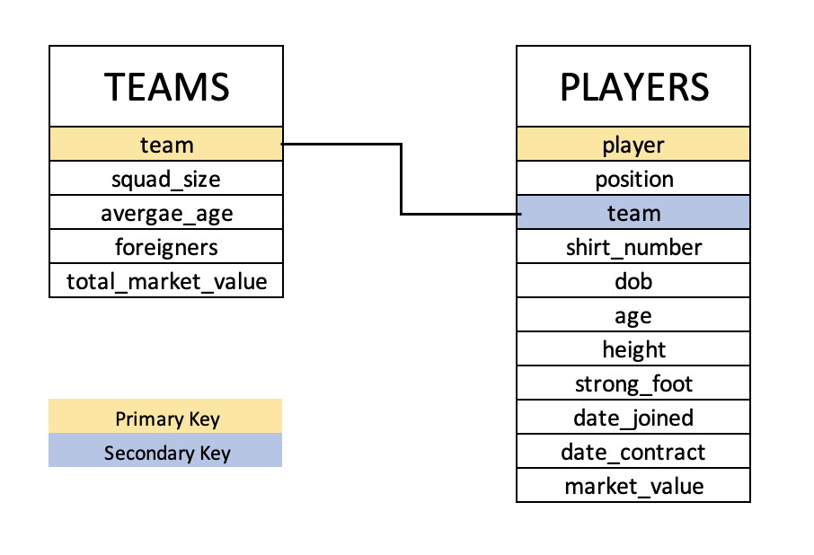
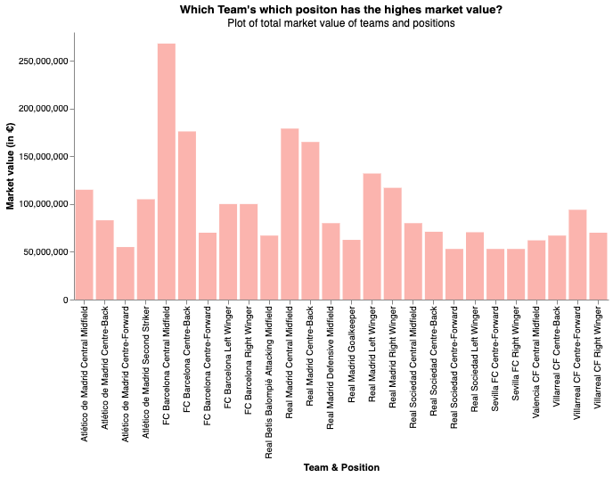

# LaLiga Data Scrapping
### By : Avi Arora

## Introduction
The Campeonato Nacional de Liga de Primera División, commonly known simply as Primera División in Spain, and as La Liga in English-speaking countries and officially as LaLiga Santander for sponsorship reasons, stylized as LaLiga, is the men's top professional football division of the Spanish football league system. Administered by the Liga Nacional de Fútbol Profesional, it is contested by 20 teams, with the three lowest-placed teams at the end of each season being relegated to the Segunda División and replaced by the top two teams and a play-off winner in that division. <br>
LaLiga is one of the most important and famous league in Europe and always has 4 teams representing them in the UEFA Champions League. 

## Objective
The aim of this project is to scrape LaLiga data and store that in a tidy format. Two datasets will be created with the following aim:
* For each team, store at least its name, total market value, and the number of foreigners.
* For each player, store at least its name, age, and current market value.
* After that the objective is to finally write a query to obtain the total market value of each team in each position (gk, defenders, midfielders, and forwards)

## Methodology
First check in the setting up of this project was to check where can the required data be found. First and a very obvious check was the offical site of LaLiga which did not have all the required information that we needed (specially the market values). For this very reason, we decided to scrape the information from [transfermarket](https://www.transfermarkt.us/).<br>
This website had all the information we needed and even more, which we decided to include in our dataset as well.
For the needs of two dataframes, two separate pipelines have been created : [Team Scrapper](codes/team_scrapper.py) and [Player Scrapper](codes/player_scrapper.py). <br>[Team Scrapper](codes/team_scrapper.py) gets the teams and [Player Scrapper](codes/player_scrapper.py) gets the players of the season provided as input and scrapes data from [transfermarket](https://www.transfermarkt.us/) to get the required datasets with the following schemas :
<br>
 
Both the codes have been written using OOPS concepts to provide reusablity and scalability. Both scrappers can be run by using the [main file](codes/main.py) and choosing run whichever scrapper is required. 


## Setup
Setting up the virtual environment will be the first and foremost task to do before running the scrappers. This will help in installing the required packages used in the python code. A [requirements](requirements.txt) file has been added in the root directory which includs all the dependencies that should be installed on the virtual environment. Failing to do so might result in errors in codes. Following is a way to create the virtual environment and install all requirements on it.

```console
$ python3.10 -m venv venv
$ source venv/bin/activate
$ pip install -r requirements.txt
```

After setting up the virtual environment, the first task is to run the [main](codes/main.py) file which instantiates both the scrappers and runs them. The documentation of both the scrapper classes can be seen in [this index file](codes/html/index.html). This report has been generated using doxygen which uses doc strings to convert doc string comments into a presentabel report. This report can be used to understand about member methods and membor attributes.


## Final Query
The final objective of the project was to write a query that gets the total market value of each team in each position.This can be done either with python or SQL depending on the teams need. For the sake of this project, python has been chosen to execute this query with the sole reason being to be able to visualize our results later. The query and the setup required before can be found in [this Jupiter notebook](codes/final_query.ipynb). The results of the qurey have been saved in a csv file and can be found [here](data/final_query.csv). <br>
After executing this query, the obvious instinct is to analyse the results. The nature of our data forces us to check what position and what team has the highest total market value. This is obviously biased as positions like midfield and forward require more players to play than let's say Goalkeeper. Since there are more players, the total market value would be more for these positions. But it will be interesting to see which team's which position has highest market value. The following plot (which can also be found [here](plots/highest_market_values.html)) gives us a better insight :

<br>
We can see in the visual that the highest market value is of Barcelona in the Centre Midfield position, followed by the same team in Centre Back position. This is a testimony of the lavish spending by the La Liga giants in the past few years. The nest best is Real Madrid in several positions which is no brainer.

