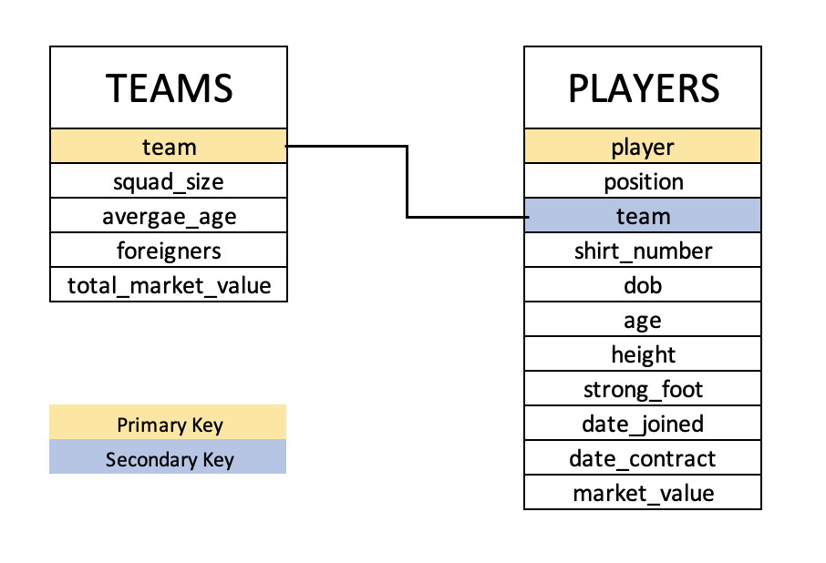

# LaLiga Data Scrapping
### By : Avi Arora
 

## Introduction
The Campeonato Nacional de Liga de Primera División, commonly known simply as Primera División in Spain, and as La Liga in English-speaking countries and officially as LaLiga Santander for sponsorship reasons, stylized as LaLiga, is the men's top professional football division of the Spanish football league system. Administered by the Liga Nacional de Fútbol Profesional, it is contested by 20 teams, with the three lowest-placed teams at the end of each season being relegated to the Segunda División and replaced by the top two teams and a play-off winner in that division.  
LaLiga is one of the most important and famous league in Europe and always has 4 teams representing them in the UEFA Champions League. 

## Objective
The aim of this project is to scrape LaLiga data and store that in a tidy format. Two datasets will be created with the following aim:
* For each team, store at least its name, total market value, and the number of foreigners.
* For each player, store at least its name, age, and current market value.

## Methodology
First check in the setting up of this project was to check where can the required data be found. First and a very obvious check was the offical site of LaLiga which did not have all the required information that we needed (specially the market values). For this very reason, we decided to scrape the information from [transfermarket](https://www.transfermarkt.us/). 
This website had all the information we needed and even more, which we decided to include in our dataset as well.
For the needs of two dataframes, two separate pipelines have been created : [Team Scrapper](codes/team_scrapper.py) and [Player Scrapper](codes/player_scrapper.py).  [Team Scrapper](codes/team_scrapper.py) gets the teams and [Player Scrapper](codes/player_scrapper.py) gets the players of the season provided as input and scrapes data from [transfermarket](https://www.transfermarkt.us/) to get the required datasets with the following schemas :
 
 
